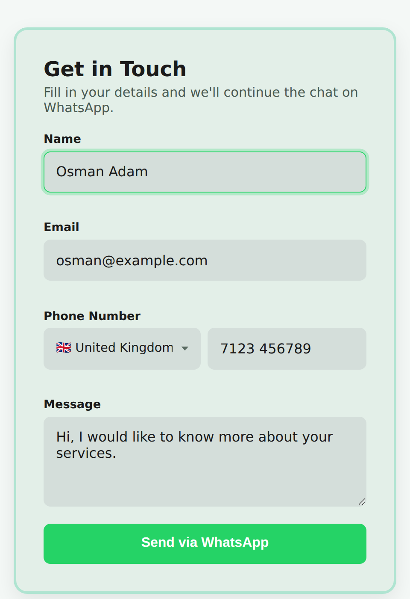
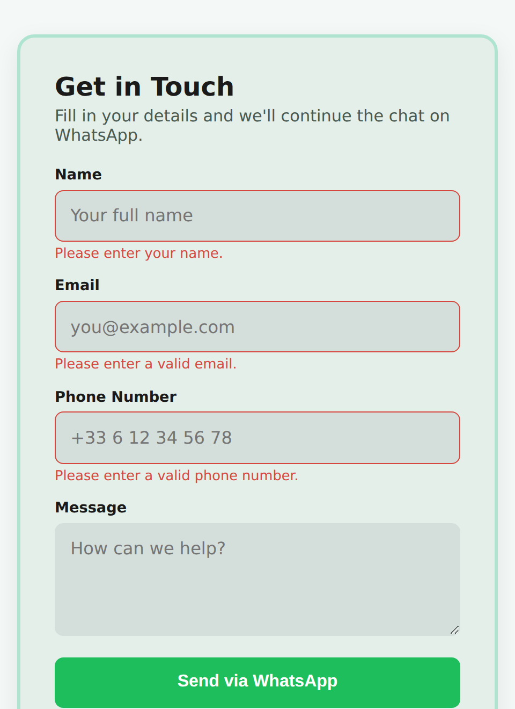

# 💬 WhatsApp Contact Form

A lightweight contact form that skips the backend entirely — submissions are validated client-side, then handed straight to WhatsApp as a pre-filled message via the [wa.me](https://faq.whatsapp.com/425247423114725) link scheme.



## ✨ Features

- Name, email, phone, and message fields with real client-side validation
- Country-code dropdown for the phone field — 24 countries, flag emoji + dial code, searchable via native `<select>`
- Inline error messages per field (no `alert()` popups)
- Hidden honeypot field to silently filter out basic spam bots
- Success toast confirms the WhatsApp tab opened, with a fallback message if pop-ups are blocked
- Submission opens WhatsApp (app or web) with a neatly formatted, properly URL-encoded message
- Accessible markup — proper `<label>`s, `aria-invalid` states, focus rings, `aria-live` toast announcements
- Zero dependencies, zero backend — works from a single static page




## 🛠️ Built With

- **HTML5** — semantic, accessible form markup
- **CSS3** — custom properties, flexbox, focus/error states
- **JavaScript (Vanilla, ES6+)** — class-based form handling, no libraries

## 📂 Project Structure

```
.
├── index.html      # Form markup
├── style.css       # Layout, theming, validation states
└── script.js       # Validation logic + WhatsApp URL builder
```

## 🚀 Getting Started

No build step or dependencies required.

1. Clone the repo
   ```bash
   git clone https://github.com/osmanadam-dev/whatsapp-contact-form.git
   ```
2. Open `script.js` and set your own WhatsApp number (see [Configuration](#-configuration) below)
3. Open `index.html` in your browser, or deploy the folder to any static host (GitHub Pages, Netlify, Vercel...)

## ⚙️ Configuration

There are two separate numbers at play here — don't mix them up:

1. **Your number** (where submissions land) — set at the bottom of `script.js`:

   ```js
   new WhatsAppForm("contact-form", "33668567513", "FR");
   //                 form id          ↑              ↑
   //                          YOUR WhatsApp     default country
   //                          number (digits      preselected in
   //                          only, no "+")       the visitor's dropdown
   ```

   Use the **full international number, digits only** — no `+`, spaces, or dashes.
   Example: a French number `+33 6 68 56 75 13` becomes `"33668567513"`.

2. **The visitor's number** — typed into the phone field using the country dropdown. This is *not* the destination; it's just included as contact info in the message text, so you (the business) can call or message them back.

To add or remove countries from the dropdown, edit the `COUNTRY_CODES` array near the top of `script.js`:

```js
{ iso: "FR", name: "France", dialCode: "33" },
```

`iso` is used to render the flag emoji and to set the default selection; `dialCode` is what gets prefixed to the visitor's number in the message.

## 🛡️ Spam Protection

The form includes a **honeypot field** — a `Company` input that's hidden off-screen with CSS, removed from keyboard tab order (`tabindex="-1"`), and hidden from screen readers (`aria-hidden="true"`). Real visitors never see or reach it.

Basic spam bots, however, often auto-fill every input on a page indiscriminately — including ones a human would never see. If that hidden field has any value on submit, the submission is silently dropped: no WhatsApp window opens, no error shown, no feedback given to the bot.

This catches unsophisticated/automated spam without adding a CAPTCHA, an account, or a backend. It won't stop a targeted human spammer or a bot built specifically against this form, but it filters out the bulk of generic crawler-driven submissions for free.

To rename the honeypot field (e.g. if a particular bot starts specifically avoiding `name="company"`), update both the `name` attribute in `index.html` and the matching key in `script.js`:

```js
honeypot: this.form.elements.company,
```

## ✅ Success Feedback

After a valid submission, `window.open()` is called to launch WhatsApp in a new tab. A **redirect was deliberately not used** here — navigating the visitor away from the page at the same moment a new tab is trying to open is a confusing double-action, and it would discard the page they were just on. A toast confirms success in place instead, without disrupting the new WhatsApp tab.

- **Pop-up succeeds:** a green toast appears ("Opening WhatsApp with your message…"), the form clears, and any leftover validation errors are cleared too
- **Pop-up blocked:** a red toast appears asking the visitor to allow pop-ups and try again — the form is **not** cleared, so nothing typed is lost
- Toasts auto-dismiss after 4 seconds, or get replaced immediately if the visitor submits again
- The toast region uses `role="status"` + `aria-live="polite"`, so screen readers announce the result without interrupting whatever the visitor is doing
- Respects `prefers-reduced-motion` for visitors who've asked for fewer animations


## ⚙️ How It Works

1. On load, the `<select id="country-code">` is populated from a `COUNTRY_CODES` array — each entry renders as a flag emoji, country name, and dial code, sorted alphabetically and defaulting to the country you configure
2. The form's `submit` event is intercepted by the `WhatsAppForm` class — no inline `onclick` handlers
3. The hidden honeypot field is checked first; if it has a value, the submission is dropped silently with no further processing
4. Each field runs through its own validator (name length, email pattern, national phone number pattern); failures render an inline error and stop submission
5. On success, the selected dial code is combined with the national number typed in (e.g. `+44` + `7123 456789`) and assembled — along with name, email, and message — into a bold-formatted WhatsApp message, passed through `encodeURIComponent` so names, messages, or emails containing `&`, `#`, accented characters, or line breaks come through correctly
6. A `wa.me` URL pointed at **your** configured number is opened in a new tab with `noopener,noreferrer` for security
7. `window.open()`'s return value is checked — if the browser blocked the pop-up it returns `null`/`undefined`, which triggers the error toast instead of a false "success" message; if it opened, the success toast shows and the form resets

## 📄 License

This project is open source and available under the [MIT License](LICENSE).

## 👤 Author

**Osman Adam**
- GitHub: [@osmanadam-dev](https://github.com/osmanadam-dev)
- Portfolio: [lnk.bio/osmanadam-dev](https://lnk.bio/osmanadam-dev)
